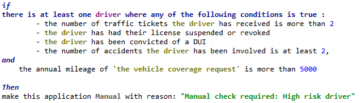
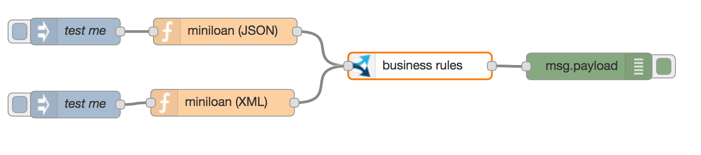
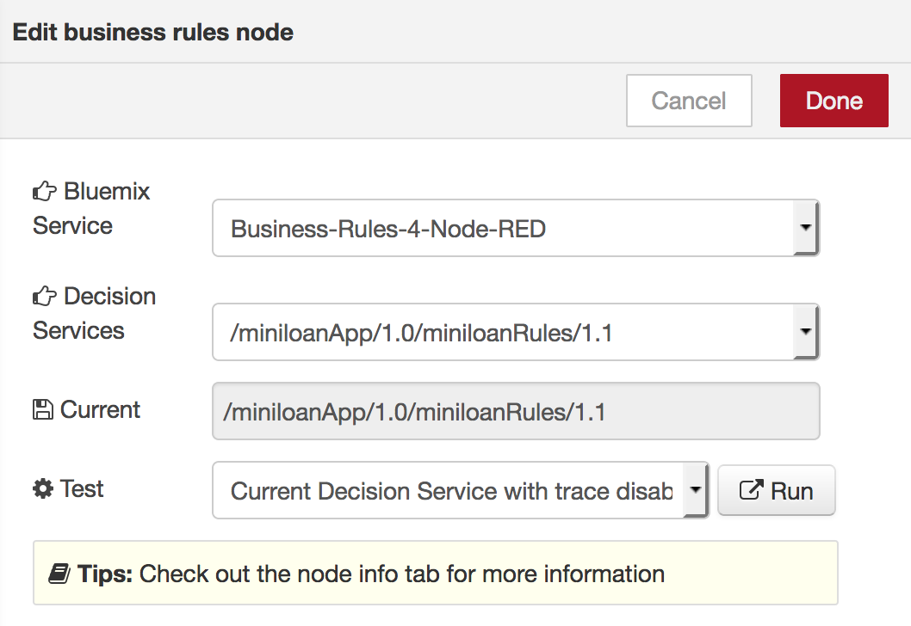
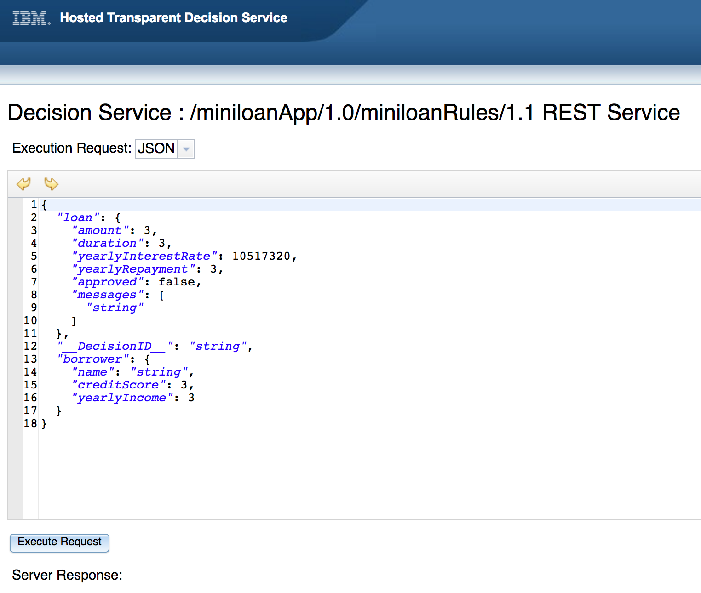
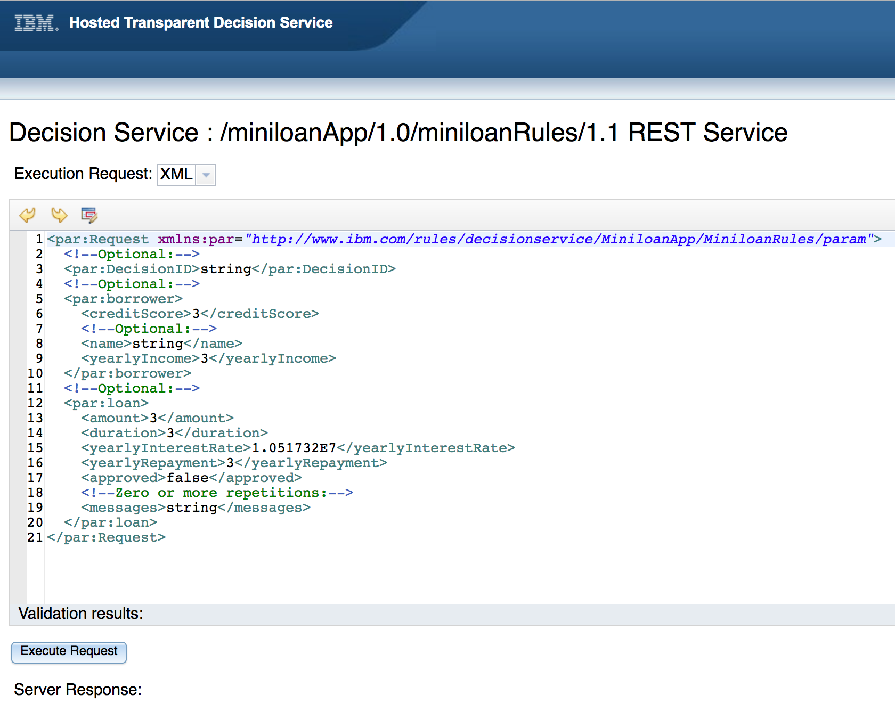

# Business Rules node on Bluemix

## About the Business Rules service
With the IBM® Business Rules for Bluemix® service, you can capture the business logic into well-structured business rules written in natural language instead of hardcoding this logic in your app.
Here is an example of business rule expressed in natural language: 

The highlighting shows the difference between the code syntax and the business rules syntax. Since the business policy can change faster than the application code, it makes sense to externalize the business logic from the application logic and be able to edit it in intuitive and natural language-like syntax.

## About the Business Rules node
The Business Rules node simplify the discovery, integration and test of a Decision Service deployed on IBM Business Rules for Bluemix service : 
- Spend less time recoding and testing when the business policy changes by keeping business logic separate from application logic.
- Simplify the integration of a Business Rules execution calls : just select one of the available Rulesets for the selected Business Rules instance.
- Use JSON or XML payload in input/output.
- **New** : add a one click Test and Debug feature for a given Decision Service, so easing the discovery, test, debugging and integration of business rulesets.

Flow Sample

Node configuration panel

Integrated Testing Tool using JSON Payload

Integrated Testing Tool using XML Payload

