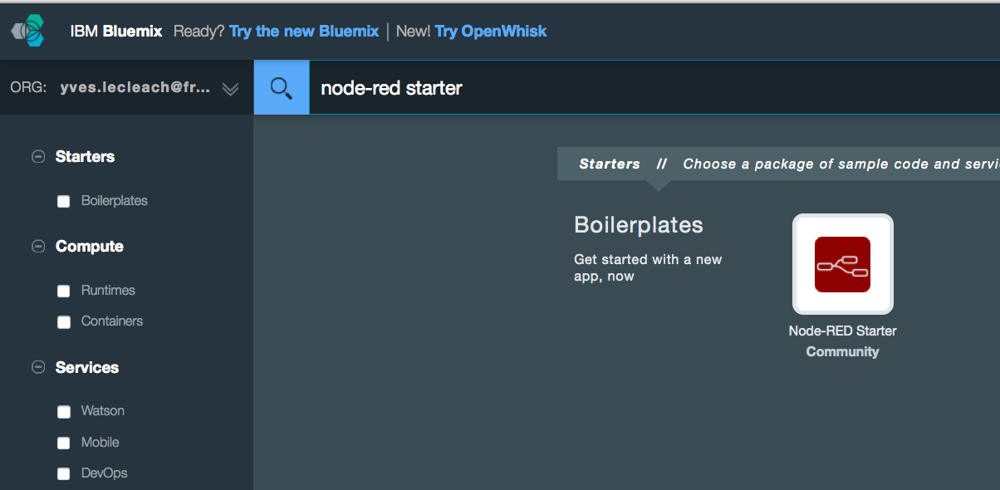
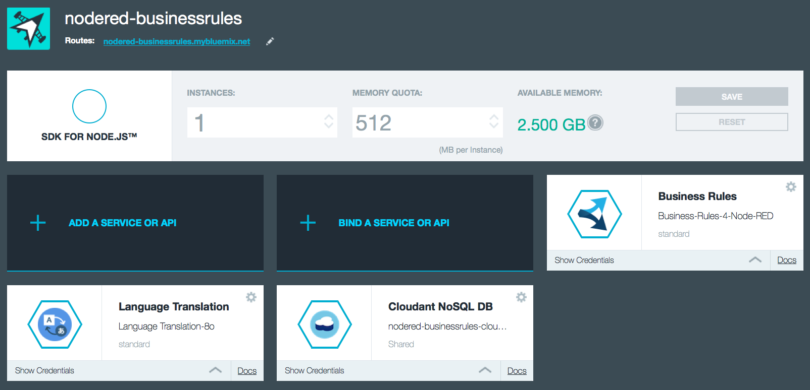
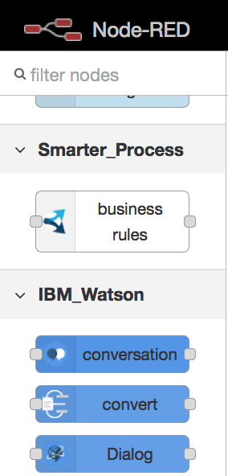
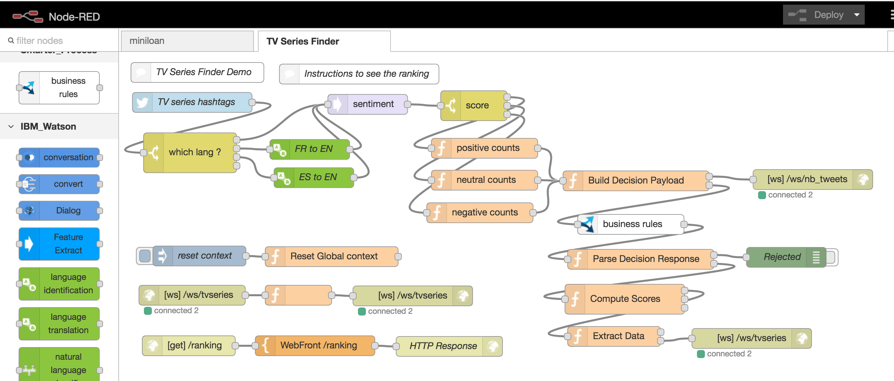
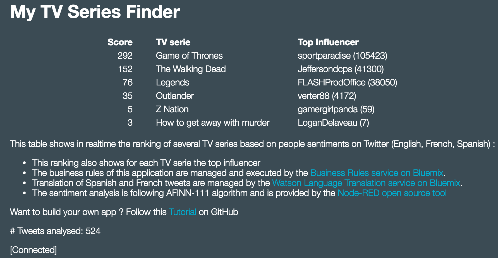

# Business Rules node tutorial : create your TV Series Finder

## Overview
Today, TV Series are more successful than movies, and new TV Series appears nearly every day. To help you to choose what will be your next TV series, we propose to build a Bluemix application called TV Series Finder, that will determine how next TV Series compares with your favorite ones, based on the people sentiment on Twitter.

This tutorial will show you how to build application using IBM Bluemix platform and you will use the following technologies :
- IBM Bluemix : the digital innovation platform.
- Node-RED : an open source tool to develop Internet applications easily by wiring nodes that input/output flows from small devices (Internet of Things), APIs, many services.
- IBM Business Rules for Bluemix : enables developers to spend less time recoding and testing when the business policy changes by keeping business logic separate from application logic
- IBM Watson Language Translation on Bluemix : able to translate many text language from a language to another. Also able to train it for specific translation domains.
- Twitter : you will need a Twitter account for this demo as the Twitter node is using in its implement the Twitter Streaming API.

## Tutorial steps
This tutorial is estimated to 30 minutes without any particular knowledge.

### Step 1
Create in minutes a Bluemix account if not already one. (free trial 30 days, no credit card required) [Sign up for IBM Bluemix Trial](https://console.ng.bluemix.net/registration/)
Connect to your account with your new credentials 
For this tutorial we assume that we are using the 'dev' "space".

### Step 2
Create a Node-RED App instance on Bluemix. Node-RED is built upon a Node.js server runtime.

Open your Node-RED app using the routes link.

Browse the Node palette. You will find many nodes that help to integrate/consume many flows from small devices, API or services.

New to Node-RED ? please read this [Introduction to Node-RED](https://github.com/watson-developer-cloud/node-red-labs/blob/master/introduction_to_node_red/README.md) and follow the Bluemix section. (Node-RED is a framework that can be deployed on small devices, a laptop or in the cloud)

### Step 3
Import the demo code into Node-RED : [flow-tvseries-finder.json](flow-tvseries-finder.json) using the Node-RED Import / Clipboard feature in the top right menu.

Need help, check out [Introduction to Node-RED](https://github.com/watson-developer-cloud/node-red-labs/blob/master/introduction_to_node_red/README.md)

### Step 4
Create a Business Rules service instance and import the demo ruleapps containing the business rules.
- Download the ruleapps archive [ruleApps-v87.jar](ruleApps-v87.jar)
- Open the Business Rules Console using your Business Rules credentials
- Use the Server Info / Restore RuleApps function. (it erases all existing rulesets in your Business Rules instance)
- Select the ruleapps archive and click on Restore
Note : in the later I will create a section on how author/design a Business Rules using Rule Designer.

### Step 4 
Create a Watson Language Translation service instance using the Bluemix Catalog

### Step 5
Bind the Business Rules and the Watson Language Translation service instances to your Node-RED App and Restage the App.

### Step 6
Open your TV Series application, and configure your Twitter credentials.
You should and you should have the following Flow properly configured and ready for usage.

Now to see the real time Ranking enter the following URL : http://[APP-NAME]/ranking 

Note : replace APP-NAME by your unique application name.

### Step 7
Share your ranking with your family, friends and collegues. Enjoy !

## Want to customize this demo for your needs ...
- you need to update the Twitter node hashtags list
- you need to update this Rule Project using Rule Designer. See Installation node and the Business Rules tutorial on Bluemix.
- redeploy a new version of the rulesets on your Business Rules service instance

Contact : Yves Le Cléach - yves.lecleach __at__ fr.ibm.com
